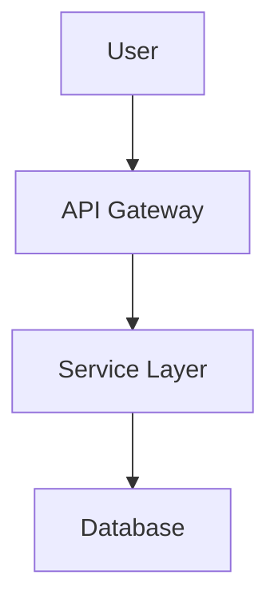
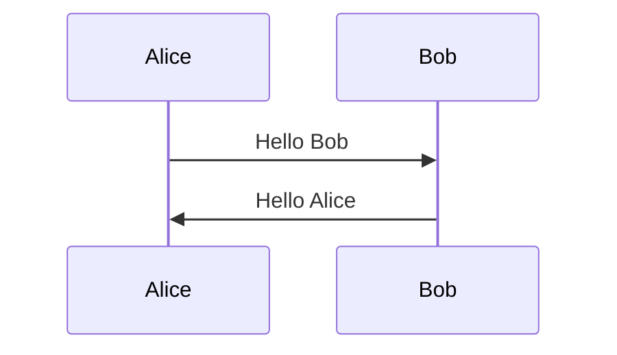

# Mermaid Markdown to PDF Converter

A powerful, containerized tool that converts markdown files containing Mermaid diagrams to professional PDF documents. Supports both inline Mermaid code blocks and external `.mmd` file references, with batch processing capabilities.

## Disclaimer
This code was almost entirely produced by Claude Sonnet models and may not work accurately. Use at your own risk. It's a simple utility that might help some people.

## ✨ Features

- **🐳 Fully Containerized**: All dependencies (pandoc, LaTeX, Chromium) bundled in Docker
- **📦 Batch Processing**: Handle multiple files and folders in one command
- **🎨 Mermaid Support**: Inline code blocks and external `.mmd` file references
- **🔧 Zero Installation**: Just Docker required - no local dependency setup
- **🌍 Cross-Platform**: Works on Linux, macOS, and Windows
- **⚡ Professional Output**: High-quality PDFs with customizable options
- **📁 Structure Preservation**: Maintains relative paths and file organization

## 🚀 Quick Start

### Prerequisites

- Docker installed on your system ([Get Docker](https://docs.docker.com/get-docker/))

### 1. Build the Container

```bash
# Clone this repository
git clone <your-repo-url>
cd mermaid-markdown-to-pdf

# Build the Docker image
./build.sh
```

### 2. Convert Your First Document

```bash
# Convert a single markdown file
docker run --rm -v $(pwd):/workspace markdown-pdf-converter README.md

# Convert multiple files
docker run --rm -v $(pwd):/workspace markdown-pdf-converter *.md

# Process an entire folder
docker run --rm -v $(pwd):/workspace markdown-pdf-converter --folder docs/
```

### 3. Create an Alias (Optional but Recommended)

```bash
# Add to your ~/.bashrc or ~/.zshrc
alias md2pdf='docker run --rm -v $(pwd):/workspace markdown-pdf-converter'

# Then use it simply:
md2pdf README.md
md2pdf --folder docs/
```

## 📖 Usage Examples

### Single File Conversion

```bash
# Basic conversion
docker run --rm -v $(pwd):/workspace markdown-pdf-converter document.md

# With custom output name
docker run --rm -v $(pwd):/workspace markdown-pdf-converter -o output.pdf document.md

# With custom options
docker run --rm -v $(pwd):/workspace markdown-pdf-converter \
  --engine xelatex \
  --margin 0.5in \
  --image-width 1600 \
  document.md
```

### Batch Processing

```bash
# Multiple specific files
docker run --rm -v $(pwd):/workspace markdown-pdf-converter \
  intro.md guide.md reference.md

# All markdown files in current directory
docker run --rm -v $(pwd):/workspace markdown-pdf-converter *.md

# Process folder recursively
docker run --rm -v $(pwd):/workspace markdown-pdf-converter --folder docs/

# Process folder non-recursively (only immediate directory)
docker run --rm -v $(pwd):/workspace markdown-pdf-converter \
  --folder docs/ --no-recursive

# Custom output directory
docker run --rm -v $(pwd):/workspace markdown-pdf-converter \
  --output-dir pdfs/ *.md
```

### Advanced Options

```bash
# High-resolution diagrams
docker run --rm -v $(pwd):/workspace markdown-pdf-converter \
  --image-width 2400 --image-height 1600 *.md

# Disable table of contents
docker run --rm -v $(pwd):/workspace markdown-pdf-converter \
  --no-toc document.md

# Keep temporary files for debugging
docker run --rm -v $(pwd):/workspace markdown-pdf-converter \
  --keep-temp --verbose document.md

# Check container dependencies
docker run --rm markdown-pdf-converter --check-deps
```

## 📝 Markdown Format

### Inline Mermaid Diagrams

```markdown
# My Document

## Architecture Diagram



## Sequence Diagram


```

### External Mermaid File References

```markdown
# My Document

## System Architecture


## Data Flow


## Network Topology

```

### Complex Project Structure Example

```
project/
├── README.md                    # Main documentation
├── docs/
│   ├── guide.md                # References ../diagrams/
│   └── api.md                  # References ./schemas/
├── diagrams/
│   ├── architecture.mmd        # External diagram
│   └── flow.mmd               # External diagram
└── schemas/
    └── database.mmd           # External diagram
```

Convert all files while maintaining references:
```bash
docker run --rm -v $(pwd):/workspace markdown-pdf-converter \
  --output-dir pdfs/ README.md docs/*.md
```

## 🎛️ Command Line Options

### Input Options
- `inputs`: Input markdown files (supports glob patterns like `*.md`)
- `--folder DIR`: Process all markdown files in directory
- `--no-recursive`: Don't search subdirectories when using `--folder`

### Output Options
- `-o, --output FILE`: Output PDF file (single file mode only)
- `--output-dir DIR`: Output directory for multiple files

### PDF Generation Options
- `--engine {xelatex,lualatex,pdflatex}`: PDF engine (default: auto-detect)
- `--margin SIZE`: Page margins (default: 1in). Examples: `0.5in`, `2cm`, `20mm`
- `--no-toc`: Disable table of contents
- `--toc-depth N`: Table of contents depth (default: 3)

### Image Processing Options
- `--image-width PIXELS`: Mermaid image width (default: 1200)
- `--image-height PIXELS`: Mermaid image height (default: 800)

### Utility Options
- `--check-deps`: Check system dependencies and exit
- `--keep-temp`: Keep temporary files for debugging
- `--verbose, -v`: Enable verbose output

## 🐳 Docker Compose Usage

For easier management, use the included `docker-compose.yml`:

```bash
# Build
docker-compose build

# Run conversions
docker-compose run --rm markdown-converter README.md
docker-compose run --rm markdown-converter --folder docs/
docker-compose run --rm markdown-converter *.md

# Interactive shell for debugging
docker-compose run --rm --entrypoint /bin/bash markdown-converter
```

## 🔧 Troubleshooting

### Permission Issues

If you encounter permission errors on Linux:

```bash
docker run --rm -v $(pwd):/workspace --user $(id -u):$(id -g) \
  markdown-pdf-converter README.md
```

### Large Files or Complex Diagrams

For projects with many large diagrams:

```bash
# Reduce image dimensions
docker run --rm -v $(pwd):/workspace markdown-pdf-converter \
  --image-width 800 --image-height 600 *.md

# Increase Docker memory limit if needed
docker run --rm -m 2g -v $(pwd):/workspace markdown-pdf-converter *.md
```

### Debugging

```bash
# Interactive shell
docker run --rm -it -v $(pwd):/workspace \
  --entrypoint /bin/bash markdown-pdf-converter

# Verbose output with temporary files preserved
docker run --rm -v $(pwd):/workspace markdown-pdf-converter \
  --verbose --keep-temp document.md
```

### Common Issues

1. **"No markdown files found"**: Check file extensions (`.md` or `.markdown`)
2. **".mmd file not found"**: Verify relative paths from markdown file location
3. **"No PDF engines available"**: Container should have all engines - try rebuilding
4. **Memory errors**: Increase Docker memory limit or reduce image dimensions

## 📁 Project Structure

```
markdown-to-pdf/
├── src/
│   ├── converter.py          # Core conversion logic
│   └── cli.py                # Command-line interface
├── tests/
│   └── test_batch.py         # Automated tests
├── examples/                  # Example markdown files
├── docs/                      # Extended documentation
├── Dockerfile                 # Container definition
├── docker-compose.yml         # Docker Compose config
├── requirements.txt           # Python dependencies
└── README.md                  # This file
```

## 📚 Supported Mermaid Diagram Types

All Mermaid diagram types are supported:

- Flowcharts (`graph` or `flowchart`)
- Sequence diagrams (`sequenceDiagram`)
- Class diagrams (`classDiagram`)
- State diagrams (`stateDiagram`)
- Entity relationship diagrams (`erDiagram`)
- User journey diagrams (`journey`)
- Gantt charts (`gantt`)
- Pie charts (`pie`)
- Git graphs (`gitgraph`)

## 🚀 CI/CD Integration

### GitHub Actions

```yaml
name: Generate Documentation
on: [push]

jobs:
  generate-docs:
    runs-on: ubuntu-latest
    steps:
      - uses: actions/checkout@v3
      
      - name: Build converter
        run: |
          cd mermaid-markdown-to-pdf
          ./build.sh
      
      - name: Generate PDFs
        run: |
          docker run --rm -v ${{ github.workspace }}:/workspace \
            markdown-pdf-converter --output-dir dist/pdfs/ docs/*.md
      
      - name: Upload PDFs
        uses: actions/upload-artifact@v3
        with:
          name: documentation-pdfs
          path: dist/pdfs/
```

### GitLab CI

```yaml
generate-docs:
  image: docker:latest
  services:
    - docker:dind
  script:
    - cd mermaid-markdown-to-pdf
    - ./build.sh
    - docker run --rm -v $PWD:/workspace 
        markdown-pdf-converter --output-dir dist/pdfs/ docs/*.md
  artifacts:
    paths:
      - dist/pdfs/
```

## 📦 Distribution

### Docker Hub

```bash
# Tag and push to Docker Hub
docker tag markdown-pdf-converter:latest yourusername/markdown-pdf-converter:latest
docker push yourusername/markdown-pdf-converter:latest

# Users can then run:
docker pull yourusername/markdown-pdf-converter:latest
docker run --rm -v $(pwd):/workspace yourusername/markdown-pdf-converter README.md
```

### GitHub Container Registry

```bash
# Tag and push to GHCR
docker tag markdown-pdf-converter:latest ghcr.io/yourusername/markdown-pdf-converter:latest
docker push ghcr.io/yourusername/markdown-pdf-converter:latest
```

## 🏗️ Architecture

### Container Details
- **Base Image**: Python 3.11 slim
- **Size**: ~2GB (includes complete LaTeX distribution)
- **Memory**: 1-2GB recommended
- **Dependencies**: 
  - Pandoc for markdown to PDF conversion
  - XeLaTeX, LuaLaTeX, PDFLaTeX for PDF generation
  - Chromium (via Playwright) for Mermaid rendering
  - Complete LaTeX packages for professional output

### Processing Flow
1. Parse markdown files and extract Mermaid diagrams
2. Detect external `.mmd` file references
3. Render all diagrams to PNG images using Chromium
4. Replace diagram references with image links
5. Generate PDF using Pandoc and LaTeX
6. Clean up temporary files

## 🤝 Contributing

Contributions are welcome! Please feel free to submit issues or pull requests.

### Development Setup

```bash
# Clone the repository
git clone <your-repo-url>
cd markdown-to-pdf

# Build the container
./build.sh

# Run tests
python tests/test_batch.py

# Test with examples
cd examples
./convert-examples.sh
```

## 📖 Documentation

- **[Getting Started](docs/GETTING-STARTED.md)** - Step-by-step setup guide
- **[Quick Reference](docs/QUICK-REFERENCE.md)** - Command cheat sheet
- **[Docker Usage](docs/DOCKER-USAGE.md)** - Docker-specific details
- **[Deployment](docs/DEPLOYMENT.md)** - Production deployment guide
- **[Contributing](docs/CONTRIBUTING.md)** - How to contribute
- **[Project Structure](docs/PROJECT-STRUCTURE.md)** - Repository organization

## 📄 License

[Add your license here]

## 🙏 Acknowledgments

- [Pandoc](https://pandoc.org/) for markdown to PDF conversion
- [Mermaid](https://mermaid.js.org/) for diagram rendering
- [Playwright](https://playwright.dev/) for browser automation
- [TeX Live](https://www.tug.org/texlive/) for LaTeX support

## 📞 Support

For issues, questions, or contributions:
- Open an issue on GitHub
- Check the troubleshooting section above
- Use `--verbose` flag for detailed error messages
- Use `--check-deps` to verify container setup

---

**Made with ❤️ for better documentation**