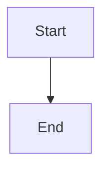

# Quick Reference Card

## Installation

```bash
# Build container
./build.sh

# Verify installation
docker run --rm markdown-pdf-converter --check-deps
```

## Create Alias (Recommended)

```bash
# Add to ~/.bashrc or ~/.zshrc
alias md2pdf='docker run --rm -v $(pwd):/workspace markdown-pdf-converter'

# Reload shell
source ~/.bashrc
```

## Basic Usage

```bash
# Single file
md2pdf document.md

# Multiple files
md2pdf doc1.md doc2.md doc3.md

# All markdown files
md2pdf *.md

# Process folder
md2pdf --folder docs/

# Custom output
md2pdf -o output.pdf document.md
```

## Common Options

```bash
# Custom output directory
md2pdf --output-dir pdfs/ *.md

# High-resolution diagrams
md2pdf --image-width 2400 --image-height 1600 document.md

# Custom margins
md2pdf --margin 0.5in document.md

# No table of contents
md2pdf --no-toc document.md

# Specific PDF engine
md2pdf --engine xelatex document.md

# Verbose output
md2pdf --verbose document.md

# Keep temp files (debugging)
md2pdf --keep-temp document.md
```

## Folder Processing

```bash
# Recursive (default)
md2pdf --folder docs/

# Non-recursive
md2pdf --folder docs/ --no-recursive

# With output directory
md2pdf --folder docs/ --output-dir pdfs/
```

## Mermaid Diagrams

### Inline Diagram

```markdown

```

### External Diagram

```markdown

```

## Troubleshooting

```bash
# Check dependencies
docker run --rm markdown-pdf-converter --check-deps

# Verbose output
md2pdf --verbose document.md

# Keep temporary files
md2pdf --keep-temp document.md

# Interactive shell
docker run --rm -it -v $(pwd):/workspace \
  --entrypoint /bin/bash markdown-pdf-converter

# Permission fix (Linux)
docker run --rm -v $(pwd):/workspace --user $(id -u):$(id -g) \
  markdown-pdf-converter document.md
```

## Docker Compose

```bash
# Build
docker-compose build

# Run
docker-compose run --rm markdown-converter document.md

# Interactive shell
docker-compose run --rm --entrypoint /bin/bash markdown-converter
```

## All Options

```
Input Options:
  inputs                Input markdown files
  --folder DIR          Process all markdown files in directory
  --no-recursive        Don't search subdirectories

Output Options:
  -o, --output FILE     Output PDF file (single file mode)
  --output-dir DIR      Output directory for multiple files

PDF Generation:
  --engine {xelatex,lualatex,pdflatex}
  --margin SIZE         Page margins (default: 1in)
  --no-toc              Disable table of contents
  --toc-depth N         TOC depth (default: 3)

Image Processing:
  --image-width PIXELS  Mermaid width (default: 1200)
  --image-height PIXELS Mermaid height (default: 800)

Utility:
  --check-deps          Check system dependencies
  --keep-temp           Keep temporary files
  --verbose, -v         Enable verbose output
  --help                Show help message
```

## Examples Directory

```bash
# Convert simple example
md2pdf examples/simple-example.md

# Convert external diagrams example
md2pdf examples/external-diagrams-example.md

# Convert all examples
md2pdf examples/*.md

# Process examples folder
md2pdf --folder examples/
```

## CI/CD Integration

### GitHub Actions

```yaml
- name: Generate PDFs
  run: |
    docker run --rm -v ${{ github.workspace }}:/workspace \
      markdown-pdf-converter --output-dir dist/pdfs/ docs/*.md
```

### GitLab CI

```yaml
script:
  - docker run --rm -v $PWD:/workspace 
      markdown-pdf-converter --output-dir dist/pdfs/ docs/*.md
```

## File Organization

```
project/
├── docs/
│   ├── guide.md
│   └── api.md
├── diagrams/
│   ├── architecture.mmd
│   └── workflow.mmd
└── pdfs/              # Output directory
```

```bash
# Convert with structure
md2pdf --output-dir pdfs/ docs/*.md
```

## Quality Presets

```bash
# Draft (fast, smaller files)
md2pdf --image-width 800 --image-height 600 document.md

# Standard (default)
md2pdf --image-width 1200 --image-height 800 document.md

# High quality (slower, larger files)
md2pdf --image-width 2400 --image-height 1600 document.md

# Print quality
md2pdf --image-width 3200 --image-height 2400 document.md
```

## Common Workflows

### Documentation Generation

```bash
# Generate all documentation
md2pdf --output-dir dist/docs/ \
  --engine xelatex \
  --margin 1in \
  README.md docs/*.md
```

### Presentation Materials

```bash
# High-quality diagrams, no TOC
md2pdf --output-dir presentations/ \
  --image-width 2400 --image-height 1600 \
  --no-toc \
  slides/*.md
```

### Technical Reports

```bash
# Professional formatting
md2pdf --output-dir reports/ \
  --engine xelatex \
  --margin 1.5in \
  --toc-depth 2 \
  report.md
```

## Getting Help

```bash
# Show help
md2pdf --help

# Check setup
docker run --rm markdown-pdf-converter --check-deps

# View examples
ls examples/
cat examples/README.md
```

## Documentation

- **README.md** - Complete documentation
- **GETTING-STARTED.md** - Step-by-step guide
- **DOCKER-USAGE.md** - Docker details
- **DEPLOYMENT.md** - Production deployment
- **CONTRIBUTING.md** - How to contribute
- **examples/** - Working examples

## Support

- Check documentation first
- Use `--verbose` for detailed output
- Use `--keep-temp` to inspect intermediate files
- Open issue on GitHub for bugs/features
- Include verbose output in bug reports