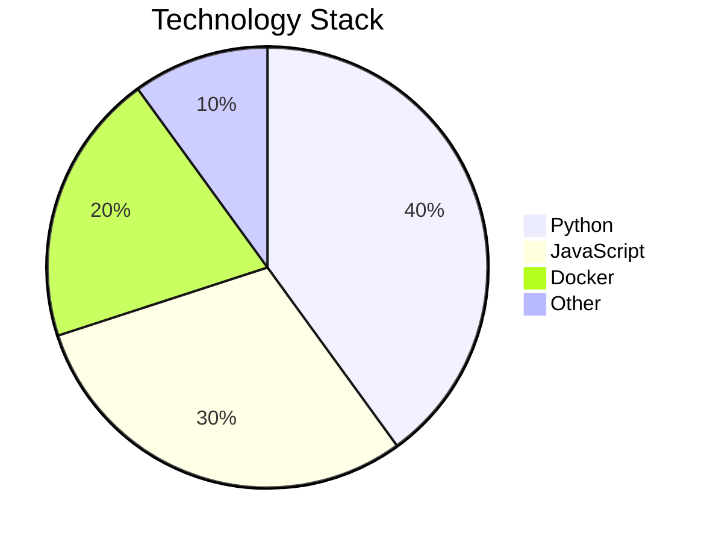

# External Diagrams Example

This example demonstrates how to reference external `.mmd` files in your markdown documents.

## Overview

External diagram files allow you to:
- Reuse diagrams across multiple documents
- Keep diagrams organized in separate files
- Maintain cleaner markdown files
- Version control diagrams independently

## System Architecture

Below is our system architecture diagram, stored in an external file:

The architecture shows the three main layers of our application:
1. **Frontend Layer**: User interface and web application
2. **Backend Layer**: API gateway, authentication, and business logic
3. **Data Layer**: Cache, database, and file storage

## User Workflow

Here's the complete user authentication and authorization workflow:

This workflow ensures secure access to our system resources.

## Mixed Content

You can also mix inline diagrams with external references:

## Conclusion

External diagram references make it easy to maintain complex documentation with reusable components.