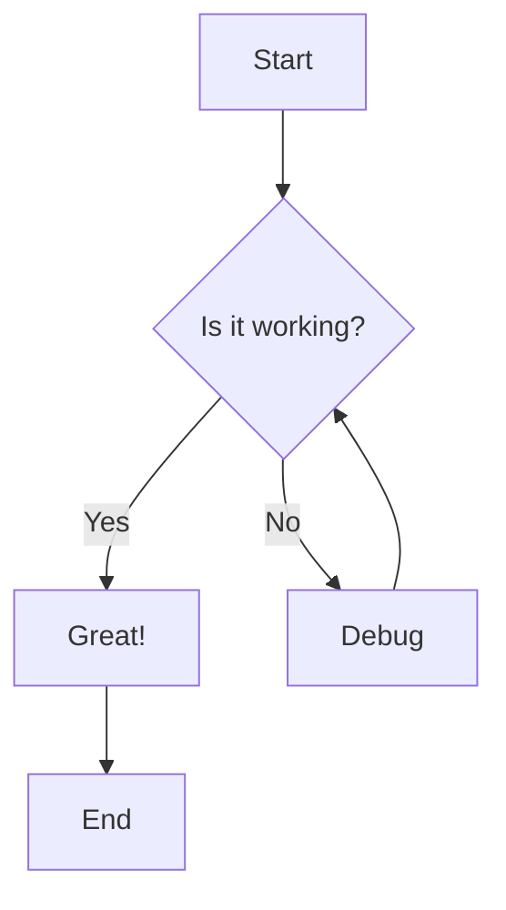
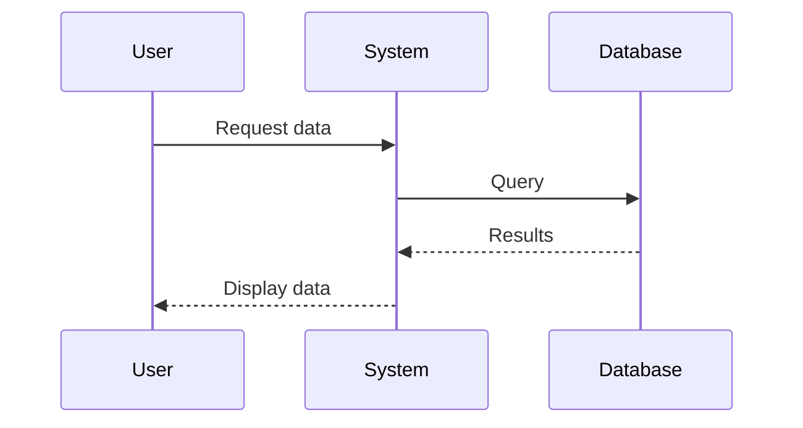

# Simple Example Document

This is a simple example demonstrating inline Mermaid diagrams.

## Introduction

This document shows how to use inline Mermaid code blocks that will be automatically converted to images in the PDF output.

## Basic Flow Chart

Here's a simple flowchart showing a basic process:

## Sequence Diagram

This sequence diagram shows a simple interaction:

## Conclusion

Both diagrams above will be rendered as high-quality images in the PDF output.